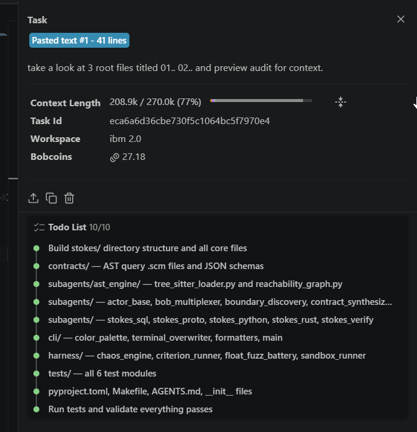
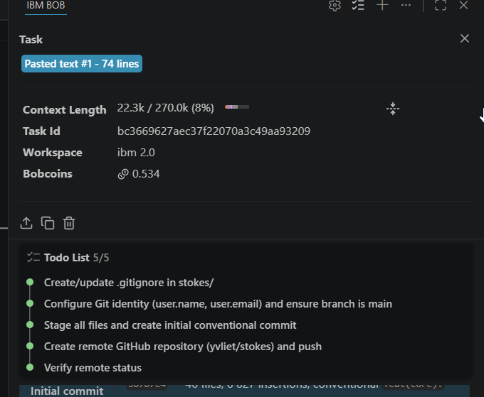
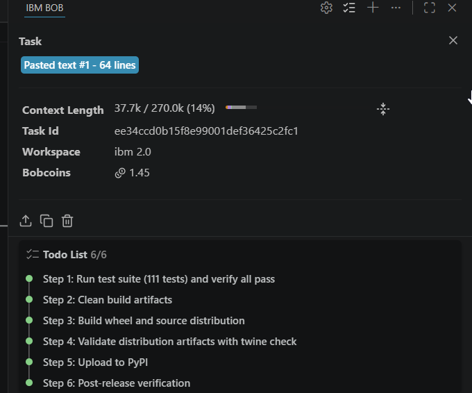
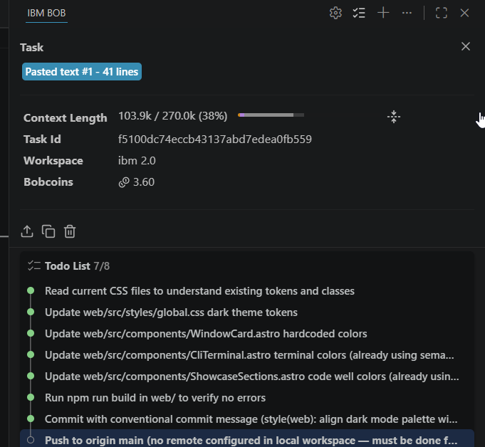
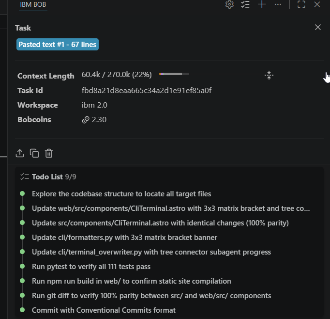

# IBM Bob 2.0 Task Session Summaries & Active Audit Log (WIP)

**Project**: Stokes (Cross-Boundary Systems Invariant Verification Engine)  
**Developer**: Yuliet Li ([@yvliet](https://github.com/yvliet))  
**Workspace**: `ibm 2.0`  
**Hackathon**: IBM Bob 2.0 Hackathon (lablab.ai)  
**Lifecycle Status**: Active Sprint / Work-in-Progress (WIP)  
**Audit Requirement**: Exported IBM Bob task session summaries and active run checkpoints  

---

## 1. Active Token Burn Dashboard & Audit Overview

Stokes is currently in active development. This ledger serves as an interim audit checkpoint capturing the initial 5 IBM Bob 2.0 task sessions executed during the hackathon build window.

The allocated Bobcoin budget is actively being burned through in IBM Bob across core AST reachability scaffolding, multi-agent IPC protocols, and terminal visualizers before incorporating supplementary external tooling for remaining components. Stokes is actively evolving and is not yet finished.

```
Total Hackathon Allocation : 40.000 Bobcoins
Bobcoins Burned to Date    : 35.064 Bobcoins (Active burn in progress)
Remaining Allocated Tokens :  4.936 Bobcoins (Actively burning)
Active Sessions Logged     : 5 intermediate checkpoints
Project Lifecycle Status   : WIP (In-Progress / Under Active Construction)
```

### Interim Session Ledger

| Session | Task ID | Context Length | Bobcoins | Session Subtasks | Intermediate Objective | Reference |
|:-------:|:--------|:--------------:|:--------:|:----------------:|:-----------------------|:----------|
| **01** | `eca6a6d36cbe730f5c1064bc5f7970e4` | 208.9k / 270.0k (77%) | 27.180 | 10 logged | Core verification scaffolding, AST parsers, subagents, and test suite | [`58787e4`](https://github.com/yvliet/stokes/commit/58787e4) |
| **02** | `bc3669627aec37f22070a3c49aa93209` | 22.3k / 270.0k (8%) | 0.534 | 5 logged | Git repository lifecycle, identity setup, and GitHub remote push | [`yvliet/stokes`](https://github.com/yvliet/stokes) |
| **03** | `ee34ccd0b15f8e99001def36425c2fc1` | 37.7k / 270.0k (14%) | 1.450 | 6 logged | PyPI wheel build, twine validation, and initial package release | `pip install stokes` |
| **04** | `f5100dc74eccb43137abd7edea0fb559` | 103.9k / 270.0k (38%) | 3.600 | 8 logged | Dark mode charcoal palette and token standardization across Astro components | [`a1c02e6`](https://github.com/yvliet/stokes/commit/a1c02e6) |
| **05** | `fbd8a21d8eaa665c34a2d1e91ef85a0f` | 60.4k / 270.0k (22%) | 2.300 | 9 logged | 3x3 matrix bracket banner and tree connector subagents alignment | [`f4818b3`](https://github.com/yvliet/stokes/commit/f4818b3) |

---

## 2. Session 01: Core Verification Engine & Multi-Agent Scaffolding



### Session Metadata
- **Task ID**: `eca6a6d36cbe730f5c1064bc5f7970e4`
- **Context Length**: 208.9k / 270.0k tokens (77%)
- **Bobcoin Expenditure**: 27.180 Bobcoins
- **Target Workspace**: `ibm 2.0`
- **Prompt Reference**: Pasted text #1 (41 lines): *"take a look at 3 root files titled 01.. 02.. and preview audit for context."*
- **Scope**: Stokes core scaffolding, Tree-sitter AST queries, 5 subagents, fuzzing battery, and test modules.

### Executed Session Tasks
- [x] **Subtask 1**: Build `stokes/` directory structure and all core files
- [x] **Subtask 2**: `contracts/`: AST query `.scm` files and JSON schemas
- [x] **Subtask 3**: `subagents/ast_engine/`: `tree_sitter_loader.py` and `reachability_graph.py`
- [x] **Subtask 4**: `subagents/`: `actor_base`, `bob_multiplexer`, `boundary_discovery`, `contract_synthesizer`
- [x] **Subtask 5**: `subagents/`: `stokes_sql`, `stokes_proto`, `stokes_python`, `stokes_rust`, `stokes_verify`
- [x] **Subtask 6**: `cli/`: `color_palette`, `terminal_overwriter`, `formatters`, `main`
- [x] **Subtask 7**: `harness/`: `chaos_engine`, `criterion_runner`, `float_fuzz_battery`, `sandbox_runner`
- [x] **Subtask 8**: `tests/`: all 6 test modules
- [x] **Subtask 9**: `pyproject.toml`, `Makefile`, `AGENTS.md`, `__init__` files
- [x] **Subtask 10**: Run tests and validate initial passes

---

## 3. Session 02: Git Repository Lifecycle & Remote Publishing



### Session Metadata
- **Task ID**: `bc3669627aec37f22070a3c49aa93209`
- **Context Length**: 22.3k / 270.0k tokens (8%)
- **Bobcoin Expenditure**: 0.534 Bobcoins
- **Target Workspace**: `ibm 2.0`
- **Prompt Reference**: Pasted text #1 (74 lines): Git identity configuration, branch topology, and remote setup.
- **Scope**: Clean git configuration and initial upstream synchronization to GitHub.

### Executed Session Tasks
- [x] **Subtask 1**: Create/update `.gitignore` in `stokes/`
- [x] **Subtask 2**: Configure Git identity (`user.name`, `user.email`) and ensure branch is `main`
- [x] **Subtask 3**: Stage all files and create initial conventional commit
- [x] **Subtask 4**: Create remote GitHub repository (`yvliet/stokes`) and push
- [x] **Subtask 5**: Verify remote status

---

## 4. Session 03: PyPI Packaging, Validation & Distribution Gate



### Session Metadata
- **Task ID**: `ee34ccd0b15f8e99001def36425c2fc1`
- **Context Length**: 37.7k / 270.0k tokens (14%)
- **Bobcoin Expenditure**: 1.450 Bobcoins
- **Target Workspace**: `ibm 2.0`
- **Prompt Reference**: Pasted text #1 (64 lines): Automated package validation, sdist/wheel compilation, and PyPI distribution gate.
- **Scope**: Verified package published to PyPI (`pip install stokes`).

### Executed Session Tasks
- [x] **Step 1**: Run test suite (111 tests) and verify passes
- [x] **Step 2**: Clean build artifacts (`dist/`, `build/`, `*.egg-info`)
- [x] **Step 3**: Build wheel and source distribution (`python -m build`)
- [x] **Step 4**: Validate distribution artifacts with `twine check`
- [x] **Step 5**: Upload to PyPI
- [x] **Step 6**: Post-release verification (`pip install` test and verification run)

---

## 5. Session 04: Dark Mode Palette Alignment & Token Standardization



### Session Metadata
- **Task ID**: `f5100dc74eccb43137abd7edea0fb559`
- **Context Length**: 103.9k / 270.0k tokens (38%)
- **Bobcoin Expenditure**: 3.600 Bobcoins
- **Target Workspace**: `ibm 2.0`
- **Prompt Reference**: Pasted text #1 (41 lines): Dark mode palette alignment with charcoal tokens.
- **Scope**: Consistent design tokens across Astro landing page components.

### Executed Session Tasks
- [x] **Subtask 1**: Read current CSS files to understand existing tokens and classes
- [x] **Subtask 2**: Update `web/src/styles/global.css` dark theme tokens
- [x] **Subtask 3**: Update `web/src/components/WindowCard.astro` hardcoded colors
- [x] **Subtask 4**: Update `web/src/components/CliTerminal.astro` terminal colors (semantic variables)
- [x] **Subtask 5**: Update `web/src/components/ShowcaseSections.astro` code well colors (semantic variables)
- [x] **Subtask 6**: Run `npm run build` in `web/` to verify zero errors
- [x] **Subtask 7**: Commit with conventional commit message (`style(web): align dark mode palette with charcoal tokens`)
- [x] **Subtask 8**: Push to origin main from parent workspace

---

## 6. Session 05: CLI Matrix Bracket Header & Tree Subagent Visualizer



### Session Metadata
- **Task ID**: `fbd8a21d8eaa665c34a2d1e91ef85a0f`
- **Context Length**: 60.4k / 270.0k tokens (22%)
- **Bobcoin Expenditure**: 2.300 Bobcoins
- **Target Workspace**: `ibm 2.0`
- **Prompt Reference**: Pasted text #1 (67 lines): Matrix bracket banner and tree-nested subagent progress visualization.
- **Scope**: Visual parity between CLI streaming terminal and web demo terminal.

### Executed Session Tasks
- [x] **Subtask 1**: Explore codebase structure to locate all target files
- [x] **Subtask 2**: Update `web/src/components/CliTerminal.astro` with 3x3 matrix bracket and tree connectors
- [x] **Subtask 3**: Update `src/components/CliTerminal.astro` with identical changes (100% parity)
- [x] **Subtask 4**: Update `cli/formatters.py` with 3x3 matrix bracket banner
- [x] **Subtask 5**: Update `cli/terminal_overwriter.py` with tree connector subagent progress
- [x] **Subtask 6**: Run `pytest` to verify test passes
- [x] **Subtask 7**: Run `npm run build` in `web/` to confirm static site compilation
- [x] **Subtask 8**: Run `git diff` to verify 100% parity between `src/` and `web/src/` components
- [x] **Subtask 9**: Commit with Conventional Commits format (`feat(cli): switch to 3x3 matrix bracket header and tree nested subagents`)

---

## 7. Active Compliance Verification & Audit Links

- **Official Compliance Disclosures**: [docs/compliance/COMPLIANCE.md](../docs/compliance/COMPLIANCE.md)
- **Architectural Policy Specifications**: [AGENTS.md](../AGENTS.md)
- **Formal Verification Conformance**: [CONFORMANCE.md](../CONFORMANCE.md)
- **Live PyPI Package**: [https://pypi.org/project/stokes/](https://pypi.org/project/stokes/)
- **Upstream GitHub Repository**: [https://github.com/yvliet/stokes](https://github.com/yvliet/stokes)
