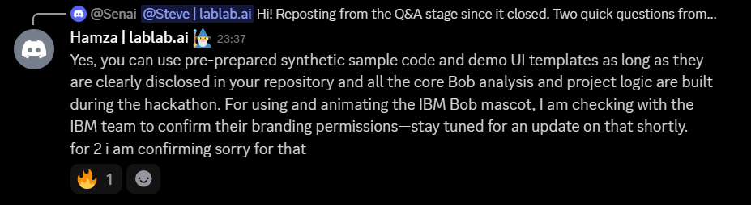
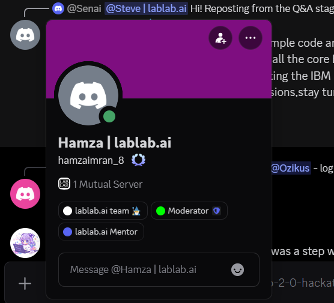

# Hackathon Compliance & Pre-Prepared Asset Disclosure

This project strictly adheres to the official IBM Bob 2.0 Hackathon regulations, build window criteria, and attribution guidelines.

---

## 1. Official Organizer Ruling

During the official hackathon Q&A stage, the lablab.ai organizing team confirmed permissions regarding pre-prepared sample code and UI templates:

> *"Yes, you can use pre-prepared synthetic sample code and demo UI templates as long as they are clearly disclosed in your repository and all the core Bob analysis and project logic are built during the hackathon. For using and animating the IBM Bob mascot, I am checking with the IBM team to confirm their branding permissions - stay tuned for an update on that shortly. for 2 i am confirming sorry for that"*

### Verification Metadata
- **Speaker**: Hamza | lablab.ai (`hamzaimran_8`)
- **Roles**: `lablab.ai team`, `Moderator`, `lablab.ai Mentor`
- **Platform**: Official Hackathon Discord
- **Message ID**: `1553083130045268114`
- **Timestamp**: September 25, 2026 at 23:37 WIB
- **Evidence Screenshots**:
  - Message Capture: [`lablab_organizer_ruling_msg.png`](./lablab_organizer_ruling_msg.png)
  - Author Profile & Role Badges: [`lablab_organizer_profile.png`](./lablab_organizer_profile.png)

---

## 2. Scope & Attribution Breakdown

### Built 100% During the Hackathon Build Window with IBM Bob 2.0
All core project logic, AST analysis engines, and autonomous orchestration workers were authored during the official hackathon sprint:
- **CLI Subcommand Suite & ANSI Renderer** (`stokes/cli/`): 60 FPS multi-line cursor addressability, bracketless grayscale loaders, and terminal diff formatters.
- **Autonomous Subagent Swarm** (`stokes/subagents/`): `stokes-sql`, `stokes-proto`, `stokes-python`, `stokes-rust`, and `stokes-verify`.
- **Cross-Boundary AST Reachability Graph** (`stokes/subagents/ast_engine/`): Tree-sitter S-expression queries and fallback regex parsing across SQL, Protobuf, Python, and Rust.
- **Async IPC Framing & Multiplexer** (`stokes/subagents/actor_base.py`, `stokes/subagents/bob_multiplexer.py`): 4-byte big-endian framing with 16.6ms render tick coalescing.
- **Verification & Fuzzing Harness** (`stokes/harness/`): 10,000-case IEEE-754 float fuzzer, Criterion benchmark parser, and RFC-2439 BGP flap simulator.
- **Test Suite** (`stokes/tests/`): 111 unit and integration tests passing in 0.55s.
- **Policy Enforcement & Lockfiles** (`AGENTS.md`, `stokes.lock`, `CONFORMANCE.md`).

### Disclosed Pre-Prepared Templates & Benchmarks
In compliance with organizer guidance, the following baseline templates were prepared prior to the build window and are transparently disclosed:
1. **Dirichlet Testbed (`dirichlet/`)**: Synthetic production-grade patient modeling the Cloudflare November 18, 2025 outage cascade (ClickHouse DDL, Python feature extractor, and Rust fixed-capacity L7 edge proxy).
2. **Web UI Presentation Shell (`web/`)**: Staged Astro frontend layout and visual presentation template.

---

## 3. IBM Bob Task Session Summaries & Active Audit Logs (WIP)

Stokes is actively under construction within the hackathon build window. Per hackathon guidelines, active IBM Bob development sessions and token consumption logs are recorded in [`bob_sessions/`](../../bob_sessions/README.md) as intermediate checkpoints.

- **Status**: Work-in-Progress (WIP - Active Development)
- **Intermediate Sessions**: 5 audited task sessions captured to date
- **Bobcoins Burned to Date**: 35.064 / 40.000 Bobcoins (ongoing token exhaustion in progress)
- **Detailed Audit Ledger & Screenshots**: See [`bob_sessions/README.md`](../../bob_sessions/README.md)

