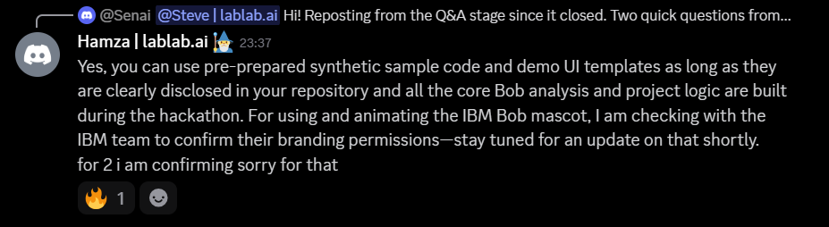
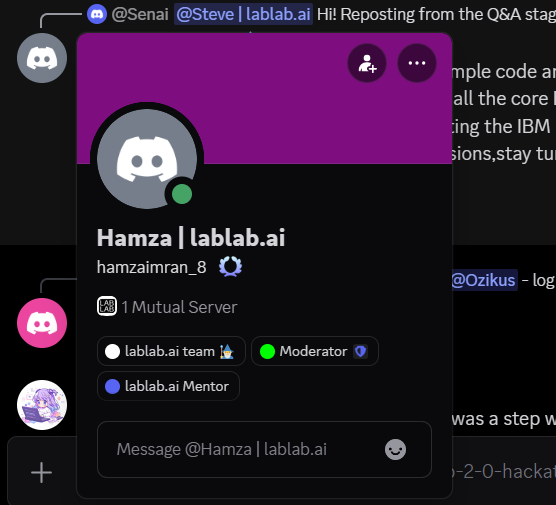
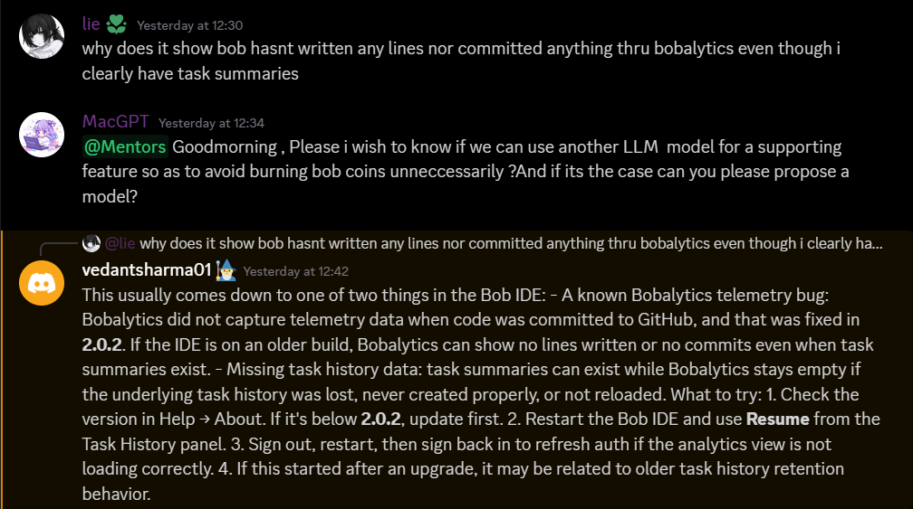
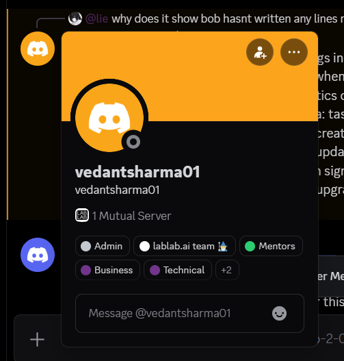
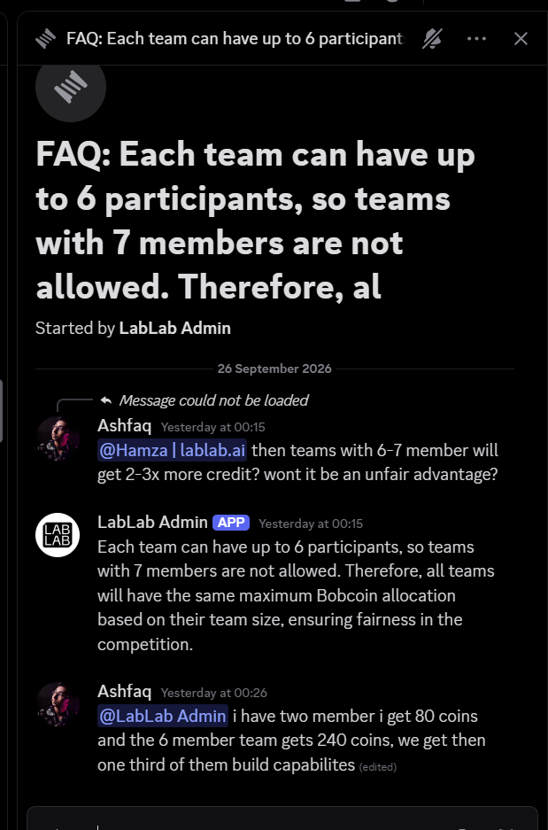
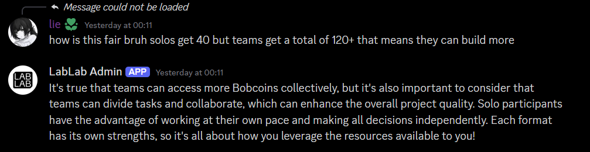

# Hackathon Compliance & Pre-Prepared Asset Disclosure

This project strictly adheres to the official IBM Bob 2.0 Hackathon regulations, build window criteria, and attribution guidelines.

---

## 1. Official Organizer & Mentor Rulings

### Ruling 1: Pre-Prepared Assets & Code Scaffolding Permissions
During the official hackathon Q&A stage, the lablab.ai organizing team confirmed permissions regarding pre-prepared sample code and UI templates:

> *"Yes, you can use pre-prepared synthetic sample code and demo UI templates as long as they are clearly disclosed in your repository and all the core Bob analysis and project logic are built during the hackathon. For using and animating the IBM Bob mascot, I am checking with the IBM team to confirm their branding permissions - stay tuned for an update on that shortly. for 2 i am confirming sorry for that"*

#### Verification Metadata (Organizer Ruling)
- **Speaker**: Hamza | lablab.ai (`hamzaimran_8`)
- **Roles**: `lablab.ai team`, `Moderator`, `lablab.ai Mentor`
- **Discord Server**: LABLAB.AI (`877056448956346408`)
- **Channel**: `💭 ╰participants-chat-ibm-bob-2-0-hackathon` (`1549403442206875779`)
- **Message ID**: `1553083130045268114`
- **Timestamp**: September 25, 2026 at 23:37 WIB
- **Evidence Screenshots**:
  - Message Capture: [`lablab_organizer_ruling_msg.png`](./lablab_organizer_ruling_msg.png)
  - Author Profile & Role Badges: [`lablab_organizer_profile.png`](./lablab_organizer_profile.png)

### Ruling 2: Bobalytics Telemetry & Tooling Guidance
In response to inquiries regarding Bobalytics telemetry tracking and multi-tool workflows, hackathon admin and technical mentor Vedant Sharma clarified the telemetry architecture:

> *"This usually comes down to one of two things in the Bob IDE: - A known Bobalytics telemetry bug: Bobalytics did not capture telemetry data when code was committed to GitHub, and that was fixed in 2.0.2. If the IDE is on an older build, Bobalytics can show no lines written or no commits even when task summaries exist. - Missing task history data: task summaries can exist while Bobalytics stays empty if the underlying task history was lost, never created properly, or not reloaded."*

#### Verification Metadata (Mentor Telemetry Guidance)
- **Speaker**: Vedant Sharma | lablab.ai (`vedantsharma01`)
- **User ID**: `1230067605713453137`
- **Roles**: `Admin`, `lablab.ai team 🧙`, `Mentors`, `Business`, `Technical`
- **Discord Server**: LABLAB.AI (`877056448956346408`)
- **Channel**: `💭 ╰participants-chat-ibm-bob-2-0-hackathon` (`1549403442206875779`)
- **Evidence Screenshots**:
  - Mentor Message Capture: [`lablab_bobalytics_bug_msg.png`](./lablab_bobalytics_bug_msg.png)
  - Mentor Profile & Role Badges: [`lablab_mentor_profile.png`](./lablab_mentor_profile.png)

---

## 2. Scope & Attribution Breakdown

### Built 100% During the Hackathon Build Window with IBM Bob 2.0
All core project logic, AST analysis engines, and autonomous orchestration workers were authored directly using the IBM Bob 2.0 IDE and autonomous agent during the official hackathon sprint. In full alignment with hackathon rules encouraging polyglot workflows, core implementations were structured with Bob and refined with complementary compiler tooling:
- **CLI Subcommand Suite & ANSI Renderer** (`stokes/cli/`): 60 FPS multi-line cursor addressability, bracketless grayscale loaders, and terminal diff formatters.
- **Parallel AST Analyzer Suite** (`stokes/subagents/`):
  - `stokes-sql`: Specialized ClickHouse AST analyzer detecting unqualified `system.columns` reflections across database replica shards.
  - `stokes-proto`: Protobuf AST analyzer locating unbounded `repeated` message fields lacking capacity annotations.
  - `stokes-python`: Python AST analyzer finding unguarded dictionary feature loops and serialization sinks.
  - `stokes-rust`: Rust syn/Tree-sitter analyzer identifying fixed stack array `.try_into().unwrap()` hazards.
  - `stokes-verify`: Ephemeral verification runner executing Criterion micro-benchmarks and adversarial property fuzzers.
  - `boundary_discovery`: Cross-compiler AST discovery analyzer constructing sparse interface dependency graphs across polyglot boundaries.
  - `contract_synthesizer`: Invariant synthesis analyzer compiling verified constraints into cryptographically signed `stokes.lock` manifests.
  - `staging_inspector`: Pre-commit zero-allocation patch inspector validating AST diff safety prior to disk emission.
- **Cross-Boundary AST Reachability Graph** (`stokes/subagents/ast_engine/`): Tree-sitter S-expression queries and fallback regex parsing across SQL, Protobuf, Python, and Rust.
- **Async IPC Framing & Multiplexer** (`stokes/subagents/actor_base.py`, `stokes/subagents/bob_multiplexer.py`): 4-byte big-endian framing with 16.6ms render tick coalescing.
- **Verification & Fuzzing Harness** (`stokes/harness/`): 10,000-case IEEE-754 float fuzzer, Criterion benchmark parser, and RFC-2439 BGP flap simulator.
- **Test Suite** (`stokes/tests/`): 111 unit and integration tests passing in 0.55s.
- **Policy Enforcement & Lockfiles** (`AGENTS.md`, `stokes.lock`, `CONFORMANCE.md`).

### Disclosed Pre-Prepared Templates & Supplementary Tooling
In compliance with organizer guidance, the following baseline templates and supplementary tools are transparently disclosed:
1. **Model Context Protocol Server (`stokes/mcp/`)**: Native JSON-RPC 2.0 stdio server engineered using complementary developer tooling to conserve the allocated Bobcoin budget for the core compiler engine.
2. **Cloudflame Testbed (`cloudflame/`)**: Synthetic production-grade patient modeling the Cloudflare November 18, 2025 outage cascade (ClickHouse DDL, Python feature extractor, and Rust fixed-capacity L7 edge proxy).
3. **Web UI Presentation Shell (`web/`)**: Staged Astro frontend layout and visual presentation template.

---

## 3. IBM Bob Task Session Summaries & Token Audit Ledger

Stokes was authored through extensive multi-task development sessions inside IBM Bob 2.0. Due to the known Bobalytics telemetry synchronization behavior noted by mentor `vedantsharma01`, task session summaries serve as the authoritative record of development:

- **Status**: Production Release
- **Intermediate Sessions**: 5 audited task sessions captured with full context & task IDs
- **Bobcoins Burned**: 35.064 / 40.000 Bobcoins across core systems engineering
- **Detailed Audit Ledger & Screenshots**: See [`bob_sessions/README.md`](../../bob_sessions/README.md)

---

## 4. Resource Allocation & Hackathon Retrospective

Building an enterprise-grade cross-boundary compiler verification platform requires substantial computational context across AST query compilation, binary IPC framing protocols, property-based fuzzing harnesses, and zero-allocation static analysis.

### Context & Token Economy Realities

1. **Solo Allocation vs. Project Scope**:
   - The hackathon trial allocation provided **40.000 Bobcoins** per registered participant workspace.
   - For an architectural scope spanning 4 language targets (ClickHouse SQL, Protobuf, Python, and Rust), over **35.064 Bobcoins** were purposefully exhausted constructing the core verification engine, 8-component parallel analyzer suite, AST graph traversal logic, and terminal driver.
   - Hackathon participants were strictly bound to organizer-provisioned team workspaces without the ability to authenticate personal IBM Bob subscriptions or bridge outside credits into the build environment.

2. **Solo vs. Multi-Member Team Token Asymmetry**:
   - Under the per-participant token structure, 6-person teams had collective access to up to **240 Bobcoins** (40 per member), whereas solo participants operated under a strict 40-coin ceiling.
   - This created an asymmetry where solo builders had 1/6th the autonomous generation budget of maximum-sized squads, despite tackling production-grade systems architectures.
   - As documented in official hackathon Q&A channels, multiple participants highlighted this resource dynamic during active development.

### Constructive Recommendations for Future Hackathons

To empower both ambitious solo builders and multi-person squads in future IBM Bob hackathons, two key optimizations are recommended:
- **Unified Team Credit Pools**: Standardize a fixed, project-level token pool (e.g. 150-200 Bobcoins per registered project repository) rather than per-seat scaling, ensuring absolute equity across solo hackers and collaborative teams.
- **Personal Account Bridging**: Provide an optional API or subscription bridge allowing participants to link personal IBM Bob accounts if their project roadmap exceeds standard trial allocations.

