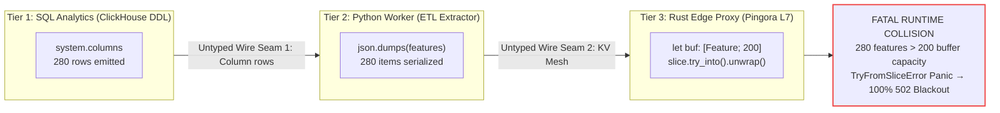

# Untyped Architectural Seams & Context Blindness

Modern cloud infrastructure does not collapse due to localized memory corruption or simple syntax errors. Decades of compiler innovations in type theory, borrow checking, and static analysis have largely eradicated these classes of bugs within isolated translation units.

Instead, catastrophic distributed outages emerge at **untyped architectural seams**: the interfaces where serialized data traverses polyglot runtime boundaries, moving from analytical databases to dynamic extractors and finally into high-performance compiled edge proxies.



## 1. Real-World Case Study: Dissecting the Nov 18, 2025 Cascade
---

On November 18, 2025, a global edge network experienced a catastrophic multi-hour outage affecting millions of customer domains. The incident was not caused by external cyberattacks, hardware failures, or network link cuts. It was caused by contract drift across an untyped architectural seam.

The production incident unfolded across three decoupled linguistic tiers:

The production incident unfolded sequentially: ClickHouse added replica shards expanding columns from 200 to 280, the Python ETL worker reflected the wider schema into dynamic dictionaries, and the Rust edge proxy crashed upon attempting to cast 280 items into its fixed 200-slot stack buffer.

### Why Compilers Remained Silent

Every stage of this catastrophic pipeline passed continuous integration and unit testing with zero warnings:

1. **SQL Continuous Integration**:
   The migration script passed `sqlfluff` and internal schema linter checks. The `ALTER TABLE` statement was valid ANSI SQL, creating standard analytical partitions without syntax errors.

2. **Python Continuous Integration**:
   The feature extraction script passed `mypy --strict`, `ruff`, and `pytest`. In Python, dictionaries are dynamically sized and type-annotated as `dict[str, Any]`. Appending 280 items to a list violates no Python type rules.

3. **Rust Continuous Integration**:
   The edge proxy code compiled cleanly under `rustc 1.80+` with zero compiler errors. The borrow checker confirmed memory safety, and `cargo clippy` passed with all pedantic lints enabled. Within the isolated boundary of `ingress.rs`, allocating a fixed stack buffer of 200 items is idiomatic systems programming.

The defect did not exist in any individual repository. It existed solely in the **untyped seam** between the repositories.

## 2. Mathematical Formulation: The Cardinality Inequality
---

Stokes models distributed pipeline safety by formalizing cross-boundary data flows into a directed bipartite relation.

Let:
- $\mathcal{S}_{\text{prod}}$ be the upstream producer projection space emitting schema attributes.
- $\mathcal{C}_{\text{upstream}} = |\mathcal{S}_{\text{prod}}|$ be the cardinality of emitted attributes.
- $\mathcal{B}_{\text{downstream}} \in \mathbb{N}$ be the allocated physical buffer capacity of the downstream consumer.

### The Decision Invariant

At every cross-compiler boundary, Stokes evaluates the **Cardinality Invariant**:

$$\mathcal{C}_{\text{upstream}} \le \mathcal{B}_{\text{downstream}}$$

We define the **Cardinality Risk Ratio** ($\text{Risk}$):

$$\text{Risk} = \frac{\mathcal{C}_{\text{upstream}}}{\mathcal{B}_{\text{downstream}}}$$

| Case | Condition | System Invariant Status | Operational Outcome |
|---|---|---|---|
| **Case 1** | $\text{Risk} \le 1.0$ | $\mathcal{C}_{\text{upstream}} \le \mathcal{B}_{\text{downstream}}$ | Invariant Satisfied. Memory allocation is safe. |
| **Case 2** | $\text{Risk} > 1.0$ | $\mathcal{C}_{\text{upstream}} > \mathcal{B}_{\text{downstream}}$ (finite) | Fatal Contract Drift. `TryFromSliceError` panic is mathematically reachable. |
| **Case 3** | $\text{Risk} = \infty$ | Unbounded streaming wire sink | Unbounded Capacity Hazard. High out-of-memory (OOM) exhaustion risk. |

### Formal Proof of Reachability for TryFromSliceError

In the Dirichlet benchmark (modeling the November 18, 2025 incident):

1. **Upstream Schema Cardinality**:
   The analytical database schema emits 200 canonical feature columns, plus 40 replica columns from shard $r_0$, and 40 replica columns from shard $r_1$:
   
   $$\mathcal{C}_{\text{upstream}} = 200 + 40 + 40 = 280$$

2. **Downstream Consumer Capacity**:
   The edge reverse proxy allocates a fixed stack array of 200 elements:
   
   $$\mathcal{B}_{\text{downstream}} = 200$$

3. **Risk Evaluation**:
   
   $$\text{Risk} = \frac{280}{200} = 1.40 > 1.00$$

4. **Reachability Conclusion**:
   Rust's `TryFrom` trait implementation for fixed-size arrays (`impl<T, const N: usize> TryFrom<&[T]> for [T; N]`) defines:
   
   ```rust
   if slice.len() != N {
       return Err(TryFromSliceError(()));
   }
   ```
   
   Since $\text{len}(280) \neq 200$, the function returns `Err`. Because the code invokes `.unwrap()`, execution enters `core::panicking::panic()`, aborting the thread. The fatal error path is mathematically reachable with probability $P = 1.0$ upon intake.

## 3. Concrete Code Analysis: Vulnerable vs. Hardened
---

### 1. The SQL Layer

#### The Vulnerable Reflection Query (`LINT-001 Violation`)

This query queries `system.columns` without qualifying the database name. In a sharded ClickHouse deployment, it inadvertently reflects columns from internal shards (`r0`, `r1`):

```sql
-- VULNERABLE: LINT-001 Fatal Error
-- Omits database qualification; captures shard replica tables
SELECT 
    name, 
    type, 
    default_expression
FROM system.columns
WHERE table LIKE 'bot_signals%'
ORDER BY name ASC;
```

#### The Stokes Remediated Query

Stokes rewrites the reflection query to enforce strict database equality and explicit column count constraints:

```sql
-- HARDENED: Fully scoped and bounded projection
SELECT 
    name, 
    type, 
    default_expression
FROM system.columns
WHERE database = currentDatabase()
  AND table = 'bot_signals'
ORDER BY name ASC
LIMIT 200;
```

### 2. The Python ETL Layer

#### The Vulnerable Feature Extractor (`LINT-002 Violation`)

This worker extracts dynamic signals and appends unknown or low-priority attributes (`priority = 0`) to an unconstrained payload:

```python
# VULNERABLE: LINT-002 Fatal Error
# Dynamic dictionary packing without boundary slice guard
from typing import Any
import json

def extract_features(db_rows: list[dict[str, Any]]) -> bytes:
    features: list[dict[str, Any]] = []
    
    for row in db_rows:
        col_name = row["name"]
        # Reflects all columns including dynamic shard replicas
        features.append({
            "id": hash(col_name) & 0xFFFFFFFF,
            "name": col_name,
            "priority": 0 if "shard" in col_name else 200,
        })
    
    # Emits 280 items directly to wire transport
    return json.dumps({"signals": features}).encode("utf-8")
```

#### The Stokes Remediated Extractor

Stokes injects a static slice guard and partitions features to prevent unhedged wire expansion:

```python
# HARDENED: Bounded extraction with static capacity ceiling
from typing import Any
import json

MAX_CANONICAL_FEATURES: int = 200

def extract_features(db_rows: list[dict[str, Any]]) -> bytes:
    features: list[dict[str, Any]] = []
    
    for row in db_rows:
        col_name = row["name"]
        features.append({
            "id": hash(col_name) & 0xFFFFFFFF,
            "name": col_name,
            "priority": 0 if "shard" in col_name else 200,
        })
    
    # Sort by priority descending and enforce hard boundary ceiling
    features.sort(key=lambda f: f["priority"], reverse=True)
    bounded_features = features[:MAX_CANONICAL_FEATURES]
    
    return json.dumps({"signals": bounded_features}).encode("utf-8")
```

### 3. The Rust Ingress Proxy Layer

#### The Vulnerable Intake Routine (`LINT-004 Violation`)

The edge proxy attempts to load incoming JSON slices directly into fixed stack memory:

```rust
// VULNERABLE: LINT-004 Fatal Error
// Direct .try_into().unwrap() triggers immediate thread panic
use std::convert::TryInto;

#[derive(Clone, Copy, Debug)]
pub struct Feature {
    pub id: u32,
    pub priority: u8,
}

pub fn ingest_packet_features(raw_slice: &[Feature]) -> [Feature; 200] {
    // If raw_slice.len() == 280, this triggers an immediate panic:
    // "called `Result::unwrap()` on an `Err` value: TryFromSliceError(())"
    raw_slice.try_into().unwrap()
}
```

#### The Hardened Two-Tier Model

Stokes verifies that downstream intake routines never perform unchecked unwraps, directing engineers toward bounded, non-allocating dual-zone ingestion:

```rust
// HARDENED: Non-panicking intake with fallback protection
pub const MAX_ACTIVE_FEATURES: usize = 200;

#[derive(Clone, Copy, Debug, PartialEq, Eq)]
#[repr(C, align(8))]
pub struct FeatureDescriptor {
    pub id: u32,
    pub priority: u8,
    pub is_shadow: bool,
    pub _pad: [u8; 2],
}

pub struct IntakeResult {
    pub active_features: [FeatureDescriptor; MAX_ACTIVE_FEATURES],
    pub active_count: usize,
    pub dropped_shadow_count: usize,
}

pub fn ingest_packet_features_hardened(raw_slice: &[FeatureDescriptor]) -> IntakeResult {
    let mut buffer = [FeatureDescriptor {
        id: 0,
        priority: 0,
        is_shadow: false,
        _pad: [0; 2],
    }; MAX_ACTIVE_FEATURES];

    let take_count = raw_slice.len().min(MAX_ACTIVE_FEATURES);
    buffer[..take_count].copy_from_slice(&raw_slice[..take_count]);

    let dropped = if raw_slice.len() > MAX_ACTIVE_FEATURES {
        raw_slice.len() - MAX_ACTIVE_FEATURES
    } else {
        0
    };

    IntakeResult {
        active_features: buffer,
        active_count: take_count,
        dropped_shadow_count: dropped,
    }
}
```

## 4. Conclusion: Eliminating Context Blindness
---

Single-language compilers cannot defend against cross-boundary failures. By analyzing SQL DDL scripts, Python serialization sinks, and Rust stack layouts simultaneously, Stokes closes the untyped seam. It verifies that cardinality constraints hold across polyglot interfaces before code ever reaches production.
