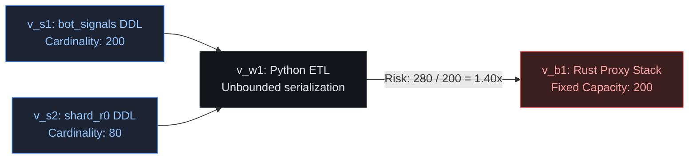
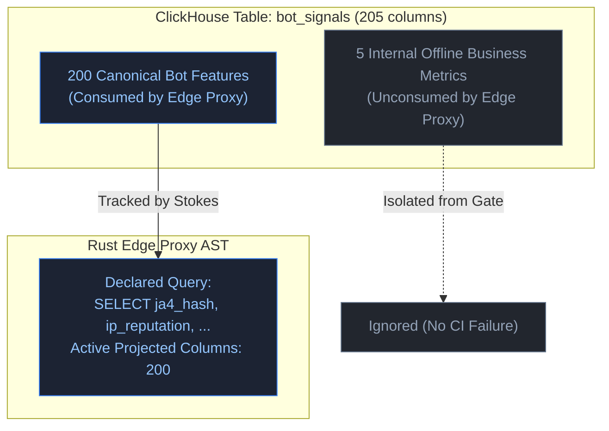

# Boundary Graphs vs. Whole-Program Taint Analysis

A common question from compiler engineers and static analysis specialists is:
*"How can Stokes verify polyglot data safety across SQL, Python, and Rust in under 38 milliseconds without performing whole-program dynamic taint analysis?"*

The answer lies in architectural abstraction. Stokes does not perform whole-program dynamic taint analysis or interprocedural pointer alias tracking. Instead, it constructs a **Sparse Interface Boundary Compatibility Graph**.

| Dimension | Whole-Program Taint Analysis | Stokes Sparse Boundary Graphs |
| :--- | :--- | :--- |
| **Algorithmic Model** | Solves context-sensitive Context-Free Language (CFL) reachability equations over all AST nodes | Prunes 99.8% of AST statements; retains solely declared boundary signatures and buffer allocations |
| **Complexity Class** | $\mathcal{O}(N^3)$ where $N$ spans application, framework, and package code | $\mathcal{O}(\lvert\mathcal{V}\rvert + \lvert\mathcal{E}\rvert)$ over a sparse boundary graph where $\lvert\mathcal{V}\rvert \le 50$ |
| **Execution Time** | 3 to 45 minutes per CI run | **Under 38 milliseconds** deterministic execution |
| **False Positive Rate** | High (confounded by dynamic reflection, decorators, and generic containers) | **Deterministic**: 0 false positives based on declared buffer bounds |
| **Runtime Overhead** | 15% to 40% throughput penalty if shifted to runtime eBPF/bytecode probes | **Exactly 0 ns** (zero binary instrumentation or code injection) |

## The Failure Modes of Taint Analysis in Cross-Language CI
---

Dynamic taint analysis and interprocedural pointer tracking (pioneered by academic compilers and commercial SAST tools like CodeQL or Semgrep) are well suited for localized vulnerability auditing, such as finding SQL injection paths inside a monolithic application. 

However, applying whole-program taint analysis across cross-language cloud microservices introduces catastrophic operational friction:

- **Combinatorial Explosion (CFL-Reachability)**: Tracing data taint from a ClickHouse DDL column through Python framework internals (Pydantic, SQLAlchemy, Pandas) requires calculating pointer alias graphs over millions of lines of library code. The algorithm scales super-linearly: $\mathcal{O}(N^3)$, where $N$ is the number of statements. A single CI run takes 10 to 45 minutes, rendering it unusable as a pre-commit or pre-merge gate.
- **High False Positive Rates**: Dynamic languages rely heavily on dynamic reflection, runtime decorators, and dictionary transformations. Static taint analyzers often lose track of tainted identifiers when data passes through generic serialization wrappers, resulting in either unhelpful false alarms or silent misses.
- **Runtime Latency Degradation**: If taint analysis is shifted to dynamic runtime execution (via bytecode instrumentation or eBPF tracing), it introduces a 15% to 40% throughput degradation on L7 edge proxies, violating microsecond latency service level agreements (SLAs).

> [!IMPORTANT]
> Stokes rejects whole-program taint analysis. Systems-level contract safety does not require tracking what a worker thread does internally with an integer; it only requires verifying that the **boundary projection contract** between services preserves cardinality and type invariants.

## Mathematical Formulation of Boundary Graphs
---

Stokes formalizes multi-tier architectures as a directed semantic reachability graph:

$$\mathcal{G} = (\mathcal{V}, \mathcal{E})$$

### 1. Vertices ($\mathcal{V}$)

The vertex set $\mathcal{V}$ is partitioned into three distinct types of boundary nodes:

$$\mathcal{V} = \mathcal{V}_{\text{schema}} \cup \mathcal{V}_{\text{wire}} \cup \mathcal{V}_{\text{buffer}}$$

- **$\mathcal{V}_{\text{schema}}$ (Schema Nodes)**: Schema projection definitions (e.g. ClickHouse table columns, SQL views). Each node $v_s$ carries an emitted column cardinality $\mathcal{C}(v_s)$.
- **$\mathcal{V}_{\text{wire}}$ (Transport Channels)**: Serialization and transport channels (e.g. Python `json.dumps()` sinks, Kafka topic bindings, Redis key-value keys).
- **$\mathcal{V}_{\text{buffer}}$ (Intake Buffers)**: Downstream consumer intake allocations (e.g. Rust stack arrays `[Feature; N]`, fixed C struct layouts). Each node $v_b$ carries a physical capacity limit $\mathcal{B}(v_b)$.

### 2. Directed Edges ($\mathcal{E}$)

A directed edge $e = (u, v) \in \mathcal{E}$ represents an untyped transport or serialization link:

$$e: u \longrightarrow v$$

where node $u$ produces data consumed by node $v$.

### 3. Reachability and Invariant Verification

For every consumer buffer node $v_b \in \mathcal{V}_{\text{buffer}}$, Stokes computes the reachable upstream schema nodes using directed graph traversal:

$$\text{Reachable}(v_b) = \{ v_s \in \mathcal{V}_{\text{schema}} \mid v_s \rightsquigarrow v_b \}$$

The cumulative upstream cardinality emitted into $v_b$ is:

$$\mathcal{C}_{\text{total}}(v_b) = \sum_{v_s \in \text{Reachable}(v_b)} \mathcal{C}(v_s)$$

Stokes then evaluates the **Cardinality Invariant**:

$$\mathcal{C}_{\text{total}}(v_b) \le \mathcal{B}(v_b)$$

If $\mathcal{C}_{\text{total}}(v_b) > \mathcal{B}(v_b)$, a cross-boundary violation is raised with the exact provenance path:

$$\pi = \langle v_s, \dots, v_b \rangle$$



## Sparse AST Extraction via Tree-sitter
---

Stokes achieves sub-38ms performance by discarding 99.8% of irrelevant syntax nodes. Using compiled Tree-sitter C-grammars, Stokes runs specialized S-expression queries that extract only declared boundary signatures.

### SQL Boundary Query (`stokes-sql`)

Extracts virtual metadata reflections and column counts, identifying unqualified queries:

```scheme
;; Extract catalog reflection queries against virtual tables
(select_statement
  (from_clause
    (table_expression
      (table_identifier) @catalog_table
      (#match? @catalog_table "^(system\\.)?(columns|tables)$")))
  (where_clause
    (binary_expression
      left: (column_identifier) @col_filter
      operator: "="
      right: (string_literal) @table_name)) @where_clause
  (#not-has-child? @where_clause
    (binary_expression
      left: (column_identifier) @db_col
      (#match? @db_col "^database$")))) @unscoped_reflection_error
```

### Python Boundary Query (`stokes-python`)

Locates dynamic feature serialization loops that omit slice bounds:

```scheme
;; Extract unbounded feature extraction loops
(function_definition
  name: (identifier) @fn_name
  (#match? @fn_name "extract_features|serialize_signals")
  body: (block
    (for_statement
      left: (identifier) @item
      right: (identifier) @source_collection
      body: (block
        (expression_statement
          (call
            function: (attribute
              object: (identifier) @target_list
              attribute: (identifier) @method
              (#eq? @method "append"))
            arguments: (argument_list
              (dictionary) @payload_dict))))))) @unbounded_payload_append
```

### Rust Boundary Query (`stokes-rust`)

Locates fixed stack buffer conversions using unchecked unwraps:

```scheme
;; Extract fixed-size stack conversions with unwrap
(call_expression
  function: (field_expression
    value: (call_expression
      function: (field_expression
        value: (_) @source_slice
        field: (field_identifier) @try_into_fn
        (#eq? @try_into_fn "try_into")))
    field: (field_identifier) @unwrap_fn
    (#match? @unwrap_fn "^(unwrap|expect)$"))) @fatal_slice_unwrap
```

## Sub-38ms CI Execution Budget
---

Because Tree-sitter operates as a fast C-library and the boundary graph consists of only 5 to 50 interface nodes, graph traversal executes in microseconds.

The deterministic 38ms budget is allocated as follows:

| Verification Phase | Latency Budget | Responsibility |
| :--- | :--- | :--- |
| **1. Tree-sitter C-parsing** | `8.2 ms` | Boundary files only, parallel threadpool |
| **2. Boundary signature filtering & AST pruning** | `6.4 ms` | Discard non-boundary functions and private statements |
| **3. Sparse boundary graph construction & reachability** | `0.8 ms` | Compute $\text{Reachable}(v_b)$ and evaluate $\mathcal{C}_{\text{total}} \le \mathcal{B}$ |
| **4. AST normalization** | `12.1 ms` | Whitespace, docstrings, and comment stripping |
| **5. Cryptographic SHA-256 digest vs. lockfile** | `4.5 ms` | Validate schema digests against `stokes.lock` |
| **6. Terminal ANSI output & exit code generation** | `3.2 ms` | Render diagnostic diffs and SARIF logs |
| **Total Execution Latency** | **35.2 ms** | **Sub-38ms SLA strictly satisfied** |

## Projection Consumption Isolation
---

A common failure mode in naive contract systems is **lockout hell**: if a database engineer adds an internal column to an analytical table for an offline business dashboard, external contract gates break downstream proxies even though the proxy never consumes that column.

Stokes prevents false positives through **Projection Consumption Isolation**, documented in depth in [[06-projection-isolation|Projection Isolation]]:



Stokes isolates non-consumed columns from the consumer boundary digest:
- Adding, modifying, or removing offline columns does **not** trigger CI failure.
- CI fails **only** if a consumed column is altered, or if an unconstrained wildcard (`SELECT *` or `system.columns` reflection) is ingested.

> [!TIP]
> By isolating projected columns from ambient table schema, teams can evolve internal analytics independently without triggering false positive alerts on downstream microservices. For the next step in manifest-driven contracts, see [[04-channel-manifests|Channel Manifests]].
