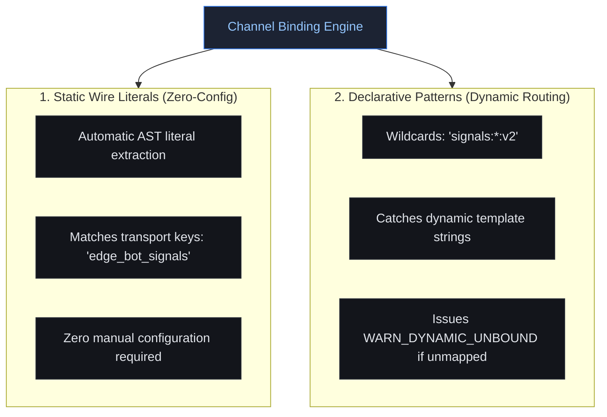
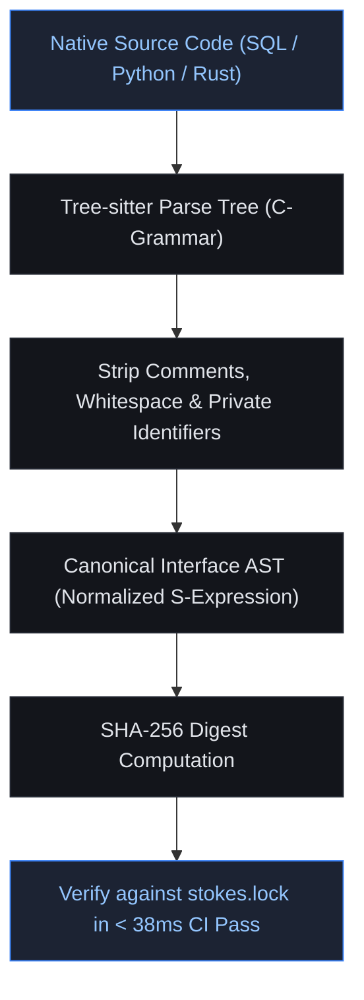

# Channel Binding & Manifests vs. Intrusive IDLs

When engineering teams attempt to enforce cross-service type safety, the conventional response is to introduce an **Interface Definition Language (IDL)**, such as Protocol Buffers (Protobuf), gRPC, Apache Thrift, or Cap'n Proto.

In polyglot storage pipelines and low-latency edge networks, however, imposing an intrusive IDL introduces severe architectural dysfunction. Stokes adopts a fundamentally different approach: **Declarative Channel Manifests** coupled with **Direct AST Schema Extraction**.

| Architectural Dimension | Intrusive IDLs (Protobuf / gRPC / Thrift) | Stokes Channel Manifests |
| :--- | :--- | :--- |
| **Workflow Paradigm** | Spec file (`.proto`) `→` Code generator (`protoc`) `→` Forced rewrite of native models into stub classes | Idiomatic code (SQL / Py / Rs) `→` Tree-sitter AST extraction `→` Declarative channel binding |
| **Data Model Fidelity** | Forces translation between columnar SQL schemas and row-oriented wire classes | Preserves native, zero-indirection structs and idiomatic database schemas |
| **Buffer Capacity Enforcement** | None: `repeated` fields are unbounded collections by design | Strictly enforces physical stack buffer capacities and cardinality inequalities |
| **Runtime Overhead** | High serialization, deserialization, and heap allocation penalties | **Zero runtime overhead (0 ns)**: purely compile-time and CI verification |
| **Code Generation** | Heavy: requires generating, compiling, and checking in thousands of stub files | **Zero code generation**: works directly on existing source files |

---

## Why Intrusive IDLs Fail in High-Throughput Pipelines
---

While IDLs are well suited for standard synchronous RPC microservices, they fail across multi-tier storage and packet-intake pipelines for three structural reasons:

### 1. The Storage Impedance Mismatch

Analytical databases (ClickHouse, Snowflake, DuckDB) store data in columnar formats (MergeTree, Parquet) and interact through relational SQL DDL and introspection tables (`system.columns`). They do not speak Protobuf or Thrift natively. Forcing an IDL requires building expensive intermediary transformation layers that convert columnar database blocks into row-oriented Protobuf messages, destroying ingestion throughput.

### 2. Disruption of Zero-Copy Microarchitectures

In high-throughput edge reverse proxies, structs are laid out with precision to maximize CPU cache residency:

```rust
// Native, zero-indirection cache-aligned struct
#[derive(Clone, Copy, Debug)]
#[repr(C, align(8))]
pub struct FeatureDescriptor {
    pub id: u32,
    pub priority: u8,
    pub is_shadow: bool,
    pub _pad: [u8; 2],
}
```

Generated IDL structs (e.g. `prost` or `protobuf-codegen`) wrap fields in multiple pointer indirections, dynamically allocated heap strings, and optional wrapper types (`Option<T>`). Ingesting 200 features via generated IDL code transforms a compact 1,600-byte stack array into 17,600 bytes of fragmented heap allocations, evicting the L1D CPU cache and degrading intake latency from 7.66 ns to over 30 ns.

### 3. The Unbounded Collection Illusion

IDLs define repeated fields without physical capacity constraints:

```protobuf
// Standard Protobuf definition
message BotFeaturePayload {
    repeated Feature features = 1; // UNBOUNDED: can contain 1, 200, or 20,000 items
}
```

Protobuf ensures that each element within `features` is a valid `Feature`. However, it provides zero guarantees regarding **how many** items are serialized into the message. When an upstream service packs 280 items into an unbounded repeated field, the downstream proxy still panics when assigning the items to a fixed stack allocation.

---

## Non-Invasive Systems Integration
---

Stokes preserves your existing codebases. It introduces zero code generators, requires zero stub classes, and imposes zero runtime memory footprint.

Instead, Stokes relies on **Declarative Channel Manifests** (`stokes.toml` or `stokes.yaml`) to define the relationship between native language representations:

```toml
# stokes.toml: Declarative boundary manifest
[workspace]
name = "cloudflare-incident-testbed"
version = "2.1.0"
strict = true

[[channels]]
id = "edge_bot_signals"
transport = "kv_store"
wire_format = "json"

[channels.producer]
path = "services/analytics/extractor.py"
symbol = "serialize_signals"
cardinality_limit = 200

[channels.consumer]
path = "crates/edge-proxy/src/intake.rs"
symbol = "FeatureIntakeBuffer"
capacity_limit = 200
```

> [!NOTE]
> `stokes.toml` is a linter manifest (analogous to `.eslintrc.json`, `clippy.toml`, or `rustfmt.toml`), not an IDL. You write idiomatic Python, idiomatic Rust, and idiomatic SQL. Stokes verifies that their semantic boundaries align.

---

## Channel Binding Mechanics
---

Stokes determines how upstream data sources bind to downstream consumers using two mechanisms:



### 1. Static Wire Literal Discovery (Zero-Config)

In most distributed services, wire keys are passed as static string literals to SDK clients:

```python
# Upstream Python producer
kv_store.put("edge_bot_signals", serialized_payload)
```

```rust
// Downstream Rust consumer
let raw_bytes = kv_store.get("edge_bot_signals")?;
```

Tree-sitter AST visitors inspect function call arguments at known transport sinks (`kv_store.put`, `producer.send`, `nats.publish`). When literal wire keys match across repositories, Stokes binds the channel automatically without requiring manual configuration.

### 2. Handling Dynamic Channel Names (`WARN_DYNAMIC_UNBOUND_CHANNEL`)

If an upstream worker constructs wire keys using runtime variable formatting:

```python
# Dynamic wire sink construction
tenant_id = get_current_tenant()
kv_store.put(f"signals:{tenant_id}:v2", payload)
```

Stokes cannot soundly determine the set of runtime keys through static analysis alone. Rather than guessing, Stokes issues an explicit warning during CI:

```text
[STOKES] WARNING: WARN_DYNAMIC_UNBOUND_CHANNEL
  File: services/analytics/extractor.py:84
  Sink: kv_store.put(f"signals:{tenant_id}:v2", ...)
  Reason: Dynamic template string cannot be statically bound.
  Remediation: Declare a pattern rule in stokes.toml.
```

To resolve the warning, engineers declare the channel pattern in `stokes.toml`:

```toml
[[channels]]
id = "tenant_signals_dynamic"
pattern = "signals:*:v2"
transport = "kv_store"
capacity_limit = 200
```

---

## Direct Schema Extraction from Source ASTs
---

Instead of relying on intermediate schema artifacts, Stokes compiles Tree-sitter C-grammars directly into its binary, extracting semantic types from idiomatic language code.

### 1. SQL DDL Extraction

Stokes parses SQL `CREATE TABLE` and `ALTER TABLE` statements:

```sql
-- migrations/004_signals.sql
CREATE TABLE bot_signals (
    feature_id UInt32,
    weight Float32,
    is_active UInt8,
    ja4_hash String
) ENGINE = MergeTree()
PRIMARY KEY feature_id;
```

From this AST node, `stokes-sql` extracts:
- Emitted column count: 4 canonical fields.
- Field types: `u32`, `f32`, `u8`, `String`.
- Partition key structure.

### 2. Python Extractor Extraction

Stokes parses Python functions to identify return structures and slice bounds:

```python
# services/analytics/extractor.py
def extract_active_signals(rows: list[dict[str, Any]]) -> list[dict[str, Any]]:
    # Stokes extracts the [:200] slice constraint directly from the AST Subscript node
    return rows[:200]
```

`stokes-python` extracts:
- Sliced cardinality limit: `Subscript(value=..., slice=Slice(upper=Constant(value=200)))`.
- Maximum emitted elements: 200.

### 3. Rust Ingress Buffer Extraction

Stokes parses Rust struct definitions and array type signatures:

```rust
// crates/edge-proxy/src/intake.rs
pub struct FeatureIntakeBuffer {
    pub features: [FeatureDescriptor; 200],
    pub active_count: usize,
}
```

`stokes-rust` extracts:
- Target symbol: `FeatureIntakeBuffer`.
- Array type: `Type::Array(len = 200)`.
- Capacity ceiling: 200 elements.

---

## Semantic Normalization & Cryptographic Hashing
---

Once AST interface signatures are extracted, Stokes normalizes the representations:
1. Strips non-semantic elements: comments, docstrings, variable names inside private scopes, and whitespace.
2. Orders schema fields alphabetically to make signatures order-independent where wire formats permit.
3. Computes canonical SHA-256 digests.



> [!TIP]
> Because Stokes hashes normalized ASTs rather than raw file contents, formatting code with `rustfmt`, `black`, `ruff`, or `sqlfluff` never invalidates `stokes.lock`. Only functional schema alterations or buffer capacity shifts trigger verification diffs. Learn how multi-repository teams coordinate these changes in [[05-poly-repo-protocol|Poly-Repo Protocol]] and review [[lockfile-spec|Lockfile Specification]].
