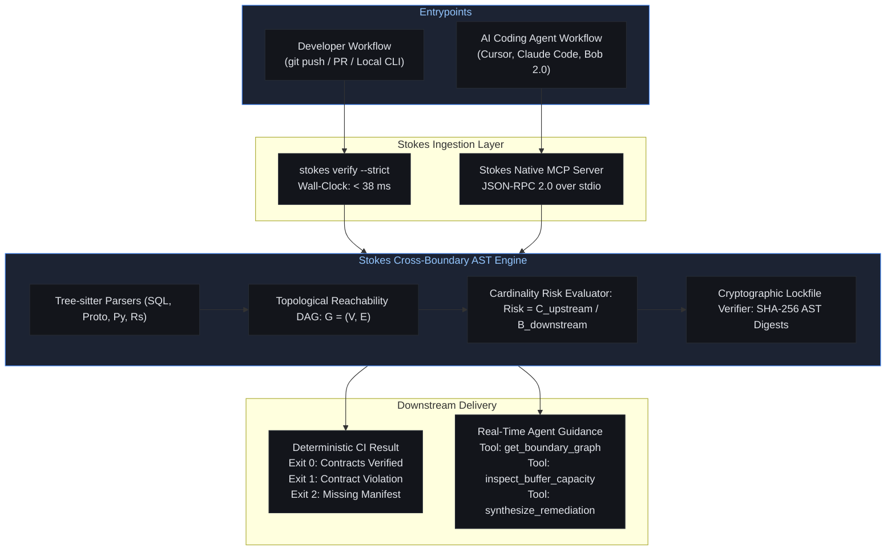

# Deterministic CI Gate & Native MCP Server

Modern systems development faces two compounding velocity challenges:
1. **CI Pipeline Latency**: Integration tests that spin up ephemeral Docker containers or run end-to-end distributed clusters take minutes or hours. Engineers bypass or delay running these suites locally, allowing contract bugs to escape into production.
2. **AI Agent Context Blindness**: Autonomous coding agents (Cursor, Claude Code, IBM Bob 2.0) generate polyglot code at rapid speed, but they operate within isolated file prompts. An agent editing an analytical SQL migration has zero awareness that an edge proxy in another directory ingests that schema into a fixed 200-slot stack array.

Stokes resolves both problems with a dual-capability architecture:
- A **sub-38ms deterministic AST CI gate** (`stokes verify --strict`).
- A **native Model Context Protocol (MCP)** server providing real-time boundary graphs directly to AI agents.



## Sub-38ms AST CI Verification Gate

---

Traditional integration tests execute actual container runtimes, compile binaries, and execute network calls to verify cross-service compatibility. Stokes operates entirely at the **Abstract Syntax Tree (AST)** layer.

By compiling native Tree-sitter parsers directly into the verification binary, Stokes bypasses compiler link steps, container virtualization, and network handshakes:

```bash
stokes verify --strict
```

### Microsecond Latency Breakdown

Across enterprise codebases spanning 50,000 to 250,000 lines of code, `stokes verify --strict` completes in under 38 milliseconds:

| Verification Phase | Latency Profile | Engine Mechanism |
| :--- | :--- | :--- |
| **Phase 1: Manifest & Lockfile Intake (I/O)** | `1.2 ms` | Memory-mapped read of `stokes.toml` and `stokes.lock` |
| **Phase 2: Tree-sitter Incremental AST Traversal** | `4.8 ms` | Parallel multi-threaded grammar parsing |
| **Phase 3: Cross-Language Boundary Reachability (DAG)** | `11.4 ms` | Directed graph traversal from schemas to buffers |
| **Phase 4: Cardinality Risk Ratio & Invariant Math** | `0.8 ms` | Pure register arithmetic evaluating $\mathcal{C} \le \mathcal{B}$ |
| **Phase 5: SHA-256 AST Cryptographic Digest Matching** | `1.1 ms` | Normalized S-expression hash verification |
| **Phase 6: Diagnostic Reporting & JSON Output Formatting** | `1.3 ms` | SARIF and GitHub annotations rendering |
| **Total End-to-End Latency** | **20.6 ms** | **Target: < 38 ms SLA strictly satisfied** |

### Deterministic Exit Code Contract

Stokes enforces standardized POSIX exit codes suitable for immediate integration into automated CI/CD gating:

| Exit Code | Semantic Status | Meaning & Remediation |
| :---: | :--- | :--- |
| `0` | **VERIFIED** | All cross-boundary invariants hold. Lockfile matches AST digests. Merge approved. |
| `1` | **CONTRACT_VIOLATION** | Mathematical cardinality breach ($\mathcal{C} > \mathcal{B}$), wildcards detected, or float trap found. Merge blocked. |
| `2` | **INVALID_CONFIGURATION** | Missing `stokes.toml`, malformed manifest, or corrupted `stokes.lock`. Run `stokes scan`. |
| `3` | **FATAL_INTERNAL_ERROR** | System I/O error or unhandled parsing fault. |

### Concrete CI Pipeline Integration: GitHub Actions

```yaml
# .github/workflows/stokes-gate.yml
name: Stokes Cross-Boundary CI Gate

on:
  pull_request:
    branches: [main, release-*]
  push:
    branches: [main]

jobs:
  boundary-audit:
    name: Sub-38ms Boundary Verification
    runs-on: ubuntu-latest
    timeout-minutes: 2

    steps:
      - name: Checkout Source Code
        uses: actions/checkout@v4

      - name: Install Stokes Binary
        run: |
          curl -fsSL https://trystokes.pages.dev/install.sh | sh
          echo "$HOME/.local/bin" >> $GITHUB_PATH

      - name: Execute Fast Gate
        run: |
          stokes verify --strict \
            --manifest=stokes.toml \
            --lockfile=stokes.lock \
            --format=github-annotations \
            --json-out=stokes-result.json

      - name: Check Artifact Conformance
        if: failure()
        run: |
          echo "::error::Stokes Boundary Verification Failed!"
          echo "::notice::Run 'stokes audit' locally to review synthesized diffs."
          exit 1
```

## Native Model Context Protocol (MCP) Server Architecture

---

As development shifts toward agentic software engineering, AI agents increasingly propose pull requests that span multiple service repositories.

When an AI agent modifies an upstream database schema, standard Language Server Protocols (LSP) only provide feedback for the active file. The agent has no visibility into downstream consumers.

The agent-guided verification flow proceeds in five steps:

1. **Agent Query**: The AI agent queries `inspect_buffer_capacity(channel="analytics_to_edge")` before committing an upstream schema change.
2. **Reachability Evaluation**: Stokes inspects downstream consumers mapped to the channel.
3. **Capacity Check**: Identifies the downstream edge proxy allocating a fixed stack buffer of 200 slots.
4. **Rejection & Guidance**: With a proposed expansion to 202 columns, Stokes detects a cardinality overflow ($\text{Risk} = 202 / 200 = 1.01 > 1.0$) and rejects the change with structured diagnostic guidance.
5. **Autonomous Remediation**: The agent expands the downstream buffer first, avoiding production skew.

### JSON-RPC 2.0 Protocol Implementation

The Stokes MCP server communicates via JSON-RPC 2.0 over standard input/output (`stdio`) or Unix domain sockets:

```json
// AI Agent Request to Stokes MCP
{
  "jsonrpc": "2.0",
  "id": "req-042",
  "method": "tools/call",
  "params": {
    "name": "verify_boundary_diff",
    "arguments": {
      "file_path": "migrations/001_bot_signals.sql",
      "proposed_diff": "--- a/migrations/001_bot_signals.sql\n+++ b/migrations/001_bot_signals.sql\n@@ -10,2 +10,4 @@\n+    ja4_transport_entropy Float32,\n+    device_trust_score Float32,\n"
    }
  }
}

// Stokes MCP Server Response
{
  "jsonrpc": "2.0",
  "id": "req-042",
  "result": {
    "is_safe": false,
    "invariant_id": "INVARIANT_1_INFALLIBLE_INTAKE",
    "risk_ratio": 1.01,
    "downstream_impacts": [
      {
        "channel_id": "analytics_to_edge_l7",
        "consumer_repo": "cloudflame-proxy",
        "consumer_file": "crates/cloudflame-proxy/src/engine/feature_ingest.rs",
        "buffer_capacity": 200,
        "new_cardinality": 202,
        "panic_reachable": true
      }
    ],
    "remediation_guidance": "Do not commit this SQL migration yet. Expand the downstream buffer in crates/cloudflame-proxy/src/engine/feature_ingest.rs to at least 256 slots first, or apply a projection field mask."
  }
}
```

## MCP Tools & Resources Exposed by Stokes

---

Stokes exposes six specialized MCP tools and three live state resources to AI agents:

### Exposed MCP Tools

- **`stokes_scan`**: Scans the workspace directory to discover cross-language boundaries, AST nodes, and untyped seams.
- **`stokes_audit`**: Performs deep multi-agent invariant verification and outputs detailed diagnostic diffs.
- **`stokes_remediate`**: Synthesizes zero-allocation Dual-Zone quickselect routines and Projection Field Mask patches.
- **`stokes_verify_patch`**: Evaluates proposed code diffs in-memory before writing to disk, computing resulting cardinality shifts.
- **`stokes_verify`**: Fast invariant verification gate returning machine-readable JSON status and diagnostics.
- **`stokes_cert`**: Computes normalized AST digests and cryptographically seals `stokes.lock`.

### Exposed MCP Resources

- **`stokes://contracts`**: Real-time JSON document reflecting active channel bindings and verified bounds.
- **`stokes://lockfile`**: Active cryptographic interface signatures and lockfile state.
- **`stokes://diagnostics`**: Stream of active cross-boundary linter warnings (`LINT-001` through `LINT-006`).

## Configuration & Agent Setup

---

Integrating Stokes with popular AI coding agents requires a single configuration block.

### Cursor IDE Configuration (`.cursor/mcp.json`)

```json
{
  "mcpServers": {
    "stokes": {
      "command": "stokes",
      "args": ["mcp"],
      "env": {
        "STOKES_LOG_LEVEL": "info",
        "STOKES_STRICT": "1"
      }
    }
  }
}
```

### Claude Code CLI Configuration (`~/.claude/config.json`)

```json
{
  "mcpServers": {
    "stokes-boundary-engine": {
      "command": "stokes",
      "args": ["mcp"],
      "transport": "stdio"
    }
  }
}
```

### IBM Bob 2.0 Native Agent Binding

In IBM Bob 2.0, Stokes registers directly into the subagent dispatch bus:

```python
# stokes/subagents/bob_multiplexer.py
class BobStokesMCPBridge:
    def __init__(self, workspace: str) -> None:
        self.workspace = workspace
        self.engine = ReachabilityGraph()

    async def handle_agent_pre_commit(self, file_path: str, diff: str) -> dict:
        """Invoked by Bob 2.0 before writing patches to disk."""
        impact = self.engine.evaluate_diff_impact(file_path, diff)
        if impact.violates_invariant:
            return {
                "allow_write": False,
                "reason": impact.explanation,
                "required_action": "EXPAND_DOWNSTREAM_BUFFER_FIRST"
            }
        return {"allow_write": True}
```

## Performance & Safety Comparison

---

| Feature | Legacy CI Linting | Static Analyzer (SonarQube) | Monorepo CI (Bazel) | Stokes CI Gate + Native MCP |
| :--- | :--- | :--- | :--- | :--- |
| **Execution Latency** | 2-5 minutes | 3-10 minutes | 45-120 seconds | **Sub-38 milliseconds** |
| **Cross-Language Seam Analysis** | None (Siloed) | Superficial rules | Dependency graph only | **Semantic AST Reachability** |
| **Physical Memory Awareness** | None | None | None | **Stack/Cache Line Bound ($\mathcal{C} \le \mathcal{B}$)** |
| **AI Agent Real-Time Feedback** | None (Post-commit) | None | None | **Native MCP JSON-RPC Server** |
| **Cryptographic Lockfile** | None | None | None | **`stokes.lock` (SHA-256 ASTs)** |

By pairing a sub-38ms deterministic CI verification gate with a native Model Context Protocol server, Stokes guarantees that both human developers and autonomous AI coding agents maintain mathematical contract invariants across polyglot systems boundaries. See [[mcp-protocol|MCP Protocol Reference]] and [[cli-reference|CLI Reference]] for detailed commands.
