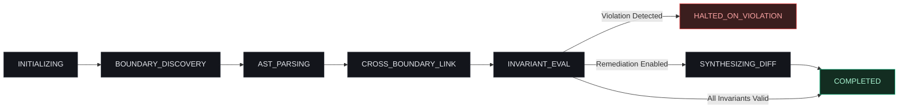

# Autonomous Subagent Actor Swarm Architecture

Modern multi-tier storage architectures cannot be evaluated using sequential, single-threaded linters. An enterprise codebase may contain thousands of ClickHouse DDL migrations, distributed Protobuf definitions, high-volume Python stream workers, and microsecond Rust proxy pipelines.

Stokes solves this scale challenge through an **Autonomous Subagent Actor Swarm** built on IBM Bob 2.0 runtime primitives. The engine dispatches concurrent, domain-specialized actors that independently crawl language ASTs, exchange structured events over a length-prefixed binary wire protocol, and reach consensus on cross-boundary invariants without deadlocks.

```mermaid
flowchart TD
    Orch["Bob 2.0 Swarm Orchestrator<br/>- Cross-Language Reachability<br/>- Automated Contract Discovery<br/>- Cryptographic Certificate Auth"]

    subgraph Swarm["Domain-Specialized Subagent Actors"]
        SQL["stokes-sql<br/>ClickHouse DDL / Shards<br/>system.columns reflection"]
        Proto["stokes-proto<br/>Protobuf repeated<br/>max_items bounds"]
        Py["stokes-python<br/>Python AST ETL bounds<br/>dict comprehension bounds"]
        Rs["stokes-rust<br/>Rust syn Dual-Zone<br/>In-Place Quickselect"]
        Verify["stokes-verify<br/>Criterion Benchmarks<br/>Proptest Float Fuzzing"]
    end

    UI["Reactive Terminal UI Driver<br/>- ANSI multi-line cursor overwrite<br/>- 60 FPS bracketless loader<br/>- Dynamic unified diff formatter"]

    Orch -->|Length-Prefixed IPC (4-Byte BE Header)| Swarm
    Swarm -->|Streaming Event Bus (maxsize=1024)| UI

    classDef default fill:#13151b,stroke:#262b35,color:#e1e4ea;
    classDef highlight fill:#1c2333,stroke:#3b82f6,color:#93c5fd;
    class Orch,UI highlight;
```

---

## The Five Specialized Domain Subagents
---

Each subagent operates as an autonomous actor with deep domain heuristics for its target language and runtime environment:

### 1. `stokes-sql` (SQL DDL & Database Reflection Auditor)
- **Target Language**: ClickHouse SQL, PostgreSQL, SQLite, MySQL.
- **Core Responsibility**: Analyzes migration files and dynamic introspection queries. Detects unscoped queries targeting `system.columns`, `system.tables`, or `information_schema.columns`.
- **Specialized Heuristics**: Enforces database qualification (`database = currentDatabase()`), identifies internal shard tables (`_r0`, `_r1`), and eliminates wildcard `SELECT *` projection hazards.
- **Synthesized Remediation**: Injects strict table and database equality predicates, adding explicit column projection limits.

### 2. `stokes-proto` (Protobuf & gRPC Cardinality Auditor)
- **Target Language**: Protocol Buffers (`.proto`, proto2 / proto3).
- **Core Responsibility**: Inspects message definitions on RPC and Kafka event paths.
- **Specialized Heuristics**: Identifies unbounded `repeated` fields that omit physical buffer bounds. Flags wire compatibility risks such as field number churn or enum tag collisions.
- **Synthesized Remediation**: Injects custom `[(stokes.max_items) = N]` schema annotations and generates validation assertions.

### 3. `stokes-python` (Dynamic ETL & Pipeline Cardinality Auditor)
- **Target Language**: Python (CPython 3.10+).
- **Core Responsibility**: Crawls Python feature extractors, Celery tasks, and data ingestion loops.
- **Specialized Heuristics**: Evaluates collection comprehensions, tracking dictionary appends and schema serialization. Flags dynamic dictionaries that append unmapped upstream fields with default `priority = 0`.
- **Synthesized Remediation**: Injects compile-time slice bounds (`features = raw_features[:MAX_CANONICAL]`) and typed dataclass schemas.

### 4. `stokes-rust` (Edge Proxy & Memory Model Auditor)
- **Target Language**: Rust (Pingora, Tokio, Envoy FFI).
- **Core Responsibility**: Verifies microarchitectural safety on low-latency packet intake paths.
- **Specialized Heuristics**: Flags `.try_into().unwrap()` or `.expect()` calls on dynamic slices ingested into fixed stack arrays (`[Feature; 200]`). Detects heap allocations (`Vec::new()`, `Box`, `String`) that trigger allocator lock contention inside epoll worker loops.
- **Synthesized Remediation**: Synthesizes zero-allocation **Dual-Zone Memory Partitioning** using in-place `select_nth_unstable_by` and converts structs to 8-byte `Copy` descriptors (`repr(C, align(8))`).

### 5. `stokes-verify` (Sandbox, Fuzzing & Simulation Coordinator)
- **Target Runtimes**: Criterion, Proptest, Linux cgroups, Docker.
- **Core Responsibility**: Orchestrates dynamic validation, executes 10,000-case IEEE-754 float fuzzing batteries, parses Criterion benchmark outputs, and simulates BGP route flaps.
- **Synthesized Remediation**: Emits the machine-authoritative `stokes.lock` and human-readable `CONFORMANCE.md` attestation.

---

## Asynchronous IPC Wire Protocol: 4-Byte Binary Framing
---

To prevent serialization bottlenecks when subagents emit high-frequency AST traversal events, the swarm communicates over length-prefixed binary frames.

| Wire Field | Length | Encoding | Purpose & Semantics |
| :--- | :--- | :--- | :--- |
| **Length Header** | 4 Bytes | Big-Endian `uint32` (`>I`) | Specifies payload body length $N$ in bytes. Enforces 16 MB maximum ceiling. |
| **Payload Body** | $N$ Bytes | UTF-8 Encoded JSON | JSON-RPC 2.0 message or typed streaming event payload. |

- **Header**: 4 bytes containing a big-endian unsigned 32-bit integer (`>I`).
- **Payload**: Canonical UTF-8 encoded JSON string.
- **Frame Budget Ceiling**: Strict 16 MB limit (`0x01000000`). If a frame header reports a size exceeding 16 MB, the socket connection is immediately terminated to protect against memory exhaustion attacks.

### Wire Protocol Framing Implementation

```python
# stokes/subagents/actor_base.py
import json
import struct
from typing import Any

MAX_FRAME_BUDGET = 0x01000000  # 16 MB

def encode_frame(payload: dict[str, Any]) -> bytes:
    """
    Encode a dictionary as a length-prefixed binary frame.
    Frame: [4-byte big-endian uint32 length][UTF-8 JSON body]
    """
    body = json.dumps(payload, separators=(",", ":")).encode("utf-8")
    if len(body) > MAX_FRAME_BUDGET:
        raise ValueError(f"Frame exceeds 16 MB budget ({len(body)} bytes)")
    header = struct.pack(">I", len(body))
    return header + body

def decode_frame(data: bytes) -> dict[str, Any]:
    """
    Decode a length-prefixed binary frame back to a dictionary.
    Raises ValueError if frame is malformed or oversized.
    """
    if len(data) < 4:
        raise ValueError("Frame too short: missing 4-byte length header")
    (length,) = struct.unpack(">I", data[:4])
    if length > MAX_FRAME_BUDGET:
        raise ValueError(f"Frame length {length} exceeds 16 MB budget")
    body = data[4 : 4 + length]
    return json.loads(body.decode("utf-8"))
```

---

## Bounded Event Bus & 16.6ms Render Tick Coalescing
---

In high-speed AST traversal, five subagents can emit up to 100,000 progress events per second. Writing each event directly to the terminal using ANSI escape codes causes:
1. Severe terminal rendering flicker.
2. High CPU usage consumed entirely by terminal emulator redraws.
3. Queue bloat and producer thread starvation.

Stokes resolves this using an `asyncio.Queue(maxsize=1024)` paired with a **16.6ms Render Tick Coalescer (60 FPS)**:

```python
# stokes/subagents/bob_multiplexer.py
import asyncio
import time
from typing import Any, Callable

class AgentMultiplexer:
    """
    Bounded event bus and render tick coalescer for Stokes subagents.
    Author: Yuliet Li (yvliet)
    """

    RENDER_TICK_SECONDS = 1.0 / 60.0  # 16.6ms (60 FPS monotonic cadence)
    MAX_QUEUE_SIZE = 1024

    def __init__(self) -> None:
        self._queue: asyncio.Queue[dict[str, Any]] = asyncio.Queue(
            maxsize=self.MAX_QUEUE_SIZE
        )
        self._coalesced_buffer: list[dict[str, Any]] = []
        self._running = False

    async def publish(self, event: dict[str, Any]) -> None:
        """
        Publish an event to the bus with backpressure.
        Yields cooperatively when queue is full, preventing producer overrun.
        """
        await self._queue.put(event)

    async def consume_all(self) -> list[dict[str, Any]]:
        """Non-blocking batch drain of all pending queue events."""
        events = []
        while not self._queue.empty():
            try:
                events.append(self._queue.get_nowait())
                self._queue.task_done()
            except asyncio.QueueEmpty:
                break
        return events

    async def run_render_loop(self, on_tick: Callable[[list[dict[str, Any]]], None]) -> None:
        """
        Monotonic 16.6ms render loop.
        Coalesces high-frequency subagent events into a single 60 FPS UI redraw.
        """
        self._running = True
        while self._running:
            await asyncio.sleep(self.RENDER_TICK_SECONDS)
            events = await self.consume_all()
            if events:
                self._coalesced_buffer.extend(events)
                on_tick(self._coalesced_buffer[:])
```

---

## Actor Base Lifecycle & Deadlock-Free Mailbox Processing
---

To maintain rock-solid stability during long-running CI runs, subagent actors implement an explicit finite state machine with fault isolation:



### Deadlock Prevention Architecture

Subagent architectures can suffer from circular wait deadlocks when actors request state synchronously from each other. Stokes eliminates deadlocks through three structural constraints:

1. **Strictly Acyclic Message Topography**:
   - Subagents emit events **unidirectionally** upward to the `BobMultiplexer`.
   - Subagents never send direct synchronous messages to peer subagents.
   - The central Orchestrator aggregates data into the Boundary Graph and provides read-only query snapshots.

2. **Bounded Non-Blocking Queues with Cooperative Yields**:
   - All mailbox queues enforce a hard capacity limit (`maxsize=1024`).
   - Producers use cooperative `await queue.put()` with timeout wrappers, preventing unbounded memory consumption.

3. **Isolated Fault Domains**:
   - If `stokes-python` encounters a syntax error in an unparseable test script, the exception is caught, packaged as a `CONTRACT_VIOLATION` event, and emitted to the multiplexer.
   - The failing actor safely transitions to `HALTED_ON_VIOLATION`, while `stokes-rust` and `stokes-sql` continue parsing uninterrupted.

---

## Execution Invariant Summary
---

| Invariant Requirement | Implementation Mechanism | Verification Standard |
| :--- | :--- | :--- |
| **Max Frame Overhead** | 4-byte big-endian uint32 prefix | Checked on every stream read; $> 16\text{ MB}$ rejected |
| **Terminal Frame Rate** | 16.6ms monotonic sleep loop | Hard 60 FPS cap; zero UI flicker |
| **Event Backpressure** | `asyncio.Queue(maxsize=1024)` | Producers yield cooperatively on queue saturation |
| **Swarm Concurrency** | `asyncio.gather(*subagents)` | Fully asynchronous coroutine execution |
| **Fault Isolation** | Per-actor exception boundaries | Actor crash produces diagnostic event without crashing swarm |

Through asynchronous binary framing, 60 FPS tick coalescing, and domain-specialized actor isolation, the Stokes subagent swarm delivers enterprise-grade verification across millions of lines of polyglot code in milliseconds. See the [[verification-harness|Verification Harness]] and [[ast-engine|AST Engine]] for downstream integration.
